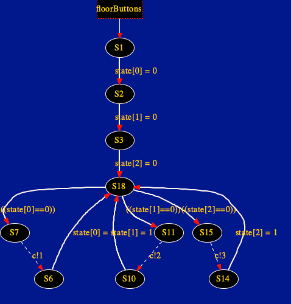

# What is about?

The project consists on the simulation of a lift system. To carry out
this project there are some concepts to identify. First of all we have
an *"elevator\"* that consists a lift which would be the variable that
identifies the floor where the cabin is located at a specific moment of
the execution, it has also the behaviour of the cabin so it can move in
the different floors. Also, the system is developed for the management
of 3 different floors.\
Below this short description is possible to see an example of this.\

As we can see there are three specific floors with the respective button
and the lift at this specific moment is on floor 1.

# Description of code

A brief introduction of the field used for the correct functionality of
this program.

-   The first variable we can see when we open the project is *chan c*.
    It is the channel that permits our controller to communicate with
    the respective button floor. Practically when a button is pressed
    the request for the plane is added on this channel, that have the
    functionality of a Queue.

            chan c = [FLOOR] of {byte};

    A simple interactive run shows us how this channel works.\

    

        
    

-   The variable state is declared in this way:

                bool state[FLOOR];

    It is an array used to define when a button is pressed or not. If
    the state\[0\] is set to true someone on floor 1 pressed the button
    and sooner or later the lift will go to floor 1.

    ![Button 3 pressed. state\[0\],state\[1\]= false;
    state\[2\]=true;](images/bottonThreePressed.png)

    \
    In this specific case someone pressed the button on floor Three and
    the elevator will go to this specific floor.\
    Another example would be with all buttons pressed. In this case, the
    lift must respect the queue order.\

    ![state\[0\],state\[1\],state\[2\]=true;
    c=\[2,1,3\]](images/allButtonPressed.png)

    \
    In this case the run will be:

    

-   The boolean opendoor is set at true when the port of the cabin is
    opened otherwise it is closed and the value is false. Initially, the
    port is closed.\

            bool opendoor=false; // door close

-   The short variable elevator indicates the current position of the
    lift. Initially, it is set at 1 which indicates the first floor.

            short elevator=1; 

-   Standing is a boolean variable that indicates that the elevator is
    at the correct floor level.

            bool standing=false;

-   The variable short piano indicates the current value read from
    channel c.

            short piano;

After having indicated the variables, it is necessary to understand the
two prototypes.\
We have the class floorButtons that indicate the behaviour of the button
that could be chosen in a non-deterministic way.\

First of all, it puts all the buttons unpressed next it enters a loop
where in a non-deterministic way chooses the button to press. If a
button is already pressed it can't be pressed again, in fact before
entering in the label *buttonXPressed* there is an *if* condition that
checks if the button is already pressed.\
The action in all the labels is set like an atomic option because the
operations must be done atomically and at the same time.\
When the button is pressed, the piano selected by the button is added to
channel c.\
The automa generated is:\

    

Furthermore, a controller has been developed which has the purpose of
reading from channel c the floor where the lift must go. Then you will
enter a loop until the elevator reaches the floor read by channel c. If
you need to enter and change the floor, the variable elevator will be
modified so that it can reach the established floor.\

    

The automa generated is:\

    

The state *S20* have the scope of read from the channel c the value of
the floor where to go.\
The state *S17* check where the elevator has to go, if it is already on
the correct floor or if it has to go up.\

# LTL formalization

-   Whenever the door is open the cabin must be standing.

                    ltl p1 { []] (opendoor -> standing)}

-   Whenever the cabin is moving the door must be closed.

                 ltl p2 { -> !opendoor)}

-   A button cannot remain pressed forever.

                ltl p3 { && &&  }

-   The door cannot remain open forever.

                ltl p4 {}

-   The door cannot remain closed forever.

                ltl p5 {}

-   Whenever the button at floor x (x=1,2,3) becomes pressed then the
    cabin will eventually be at the floor x with the door open

                ltl p6 {)}

-   Whenever no button is currently pressed and the button at floor x (x
    = 1, 2, 3) becomes pressed and, afterwards, also the button at floor
    y (y =! x and y = 1, 2, 3) becomes pressed and, in the meanwhile, no
    other button becomes pressed then the cabin will be standing at
    floor x with the door open and, afterwards, the cabin will be
    standing at floor y with the door open and in the meanwhile the
    cabin will not be standing at any other floor different from y with
    the door open.
    
    the rule was written for every possible pair of floors. To be exact,
    the order of the pairs is: 1.2; 1.3; 2.1; 2.3; 3.1; 3.2.\
    Initially, it is checked that each button is not pressed, then it is
    checked that first one button is pressed and then the other. In the
    second part after the implication it is simply checked that the
    first value of the pair is executed first and then the second (that
    is, that the lift goes first to floor x and then to floor y).

# Conclusion

Running all the properties together doesn't find some type of error.\

    

The building of the project could require some seconds because the last
LTL property is heavy. All the properties are checked in a few seconds
without errors. Finally, the project respects all requirements easily,
separating the behaviour of the buttons from the general behaviour of
the elevator which is managed entirely by the controller and by the
three variables opendoor, standing and elevator.
